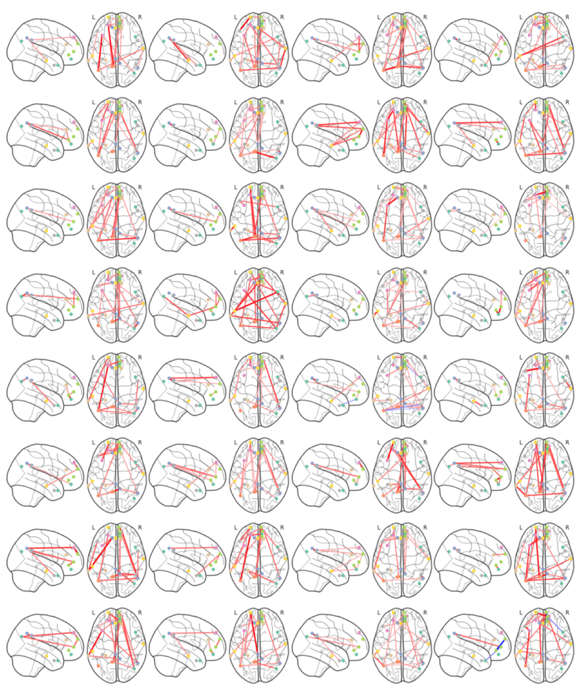
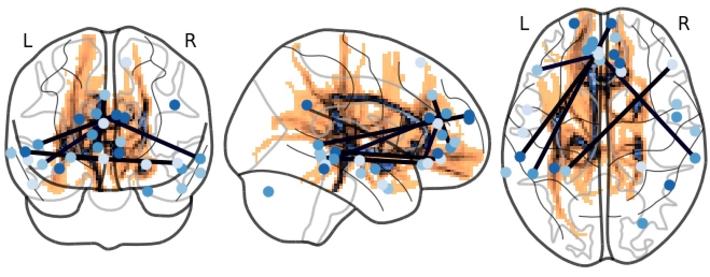

======
PyNets
======


About
-----
A Python-Powered Workflow for Network Analysis of Resting-State fMRI (rsfMRI) and Diffusion MRI (dMRI)

Problem: A comprehensive, flexible, and fully-automated network analysis package for neuroimaging has yet to be implemented.

Solution: In PyNets, we harness the power of nipype, nilearn, and networkx python packages to automatically generate a range of graph theory metrics on a subject-by-subject basis. Uniquely, PyNets utilities can be integrated with ANY existing preprocessing workflow for your data.

Learn more about Nipype: http://nipype.readthedocs.io/en/latest/index.html

Learn more about Nilearn: http://nilearn.github.io/

Learn more about Networkx: https://networkx.github.io/

More specifically: PyNets utilizes nilearn and networkx tools in a nipype workflow to automatically generate rsfMRI networks (whole-brain, or RSN's like the DMN) and associated dMRI structural networks based on a variety of atlas-defined parcellation schemes, and then automatically plot associated adjacency matrices, connectome visualizations, and extract the following graph theoretical measures from those networks with a user-defined thresholding:\
global efficiency, local efficiency, transitivity, degree assortativity coefficient, average clustering coefficient, average shortest path length, betweenness centrality, eigenvector centrality, degree pearson correlation coefficient, number of cliques, smallworldness, rich club coefficient, communicability centrality, and louvain modularity.

-----

Walkthrough of the fully-automated pipeline:

Required User Inputs:

	-Subject's data- Any 4D preprocessed fMRI file or diffusion weighted image file with completed bedpostx outputs (in construction)
	-A subject ID (user-specified name of the directory containing the input data)
	-(Almost) any atlas by name, by custom atlas parcellation file, by Bootstrap Analysis of Stable Clusters (BASC) for subject-level parcellation (in construction), or a combination of atlases! (also in construction)
	-Graph or subgraph specification (i.e. Whole-brain or individual RSN's)

Step 1: PyNets models a functional connectivity matrix for the rsfMRI data (based on correlation, accelerated correlation fit using brainiak's blas-powered model estimation, covariance, or sparse inverse covariance)

Step 2: PyNets optionally models a probabilistic (i.e. weighted) structural connectivity matrix (in construction) using dMRI bedpostx outputs.

Step 3: PyNets creates connectome plots and adjacency matrices (soon to be optional!)

Step 4: PyNets extracts network statistics for both functional and structural graphs

Step 5: PyNets aggregates individual network data into a group database (see README pandas snippet below for help)

Step 6: PyNets reduces dimensionality of nodal metrics at the group level using cluster analysis and/or PCA (in construction)

-----

1. Installation
PyNets is now available for python3 in addition to python2.7! We recommend using python3.
```python
##Clone the PyNets repo and install dependencies
git clone https://github.com/dpisner453/PyNets.git
cd /path/to/PyNets
python3 setup.py install

#Or within the PyNets parent directory:
pip3 install -e .
```

2. Usage:\
Situation A) You have a fully preprocessed (normalized and skull stripped!) functional rsfMRI image called "filtered_func_data_clean_standard.nii.gz" where the subject id=997, you wish to extract network metrics for a whole-brain network, using the nilearn atlas 'coords_dosenbach_2010', you wish to threshold the connectivity graph by preserving 95% of the strongest weights (also the default), and you wish to use basic correlation model estimation:
```python
python /path/to/PyNets/pynets.py -i '/Users/dpisner453/PyNets_examples/997/filtered_func_data_clean_standard.nii.gz' -ID '997' -a 'coords_dosenbach_2010' -model 'corr'
```
&nbsp;&nbsp;&nbsp;&nbsp;&nbsp; Situation B) You have a fully preprocessed (normalized and skull stripped!) functional rsfMRI image  called "filtered_func_data_clean_standard.nii.gz" where the subject id=997, you wish to extract network metrics for the DMN network, using the 264-node atlas parcellation scheme from Power et al. 2011 called 'coords_power_2011', you wish to threshold the connectivity graph iteratively to achieve a target density of 0.3, you define your node radius as 4 voxels in size (3 is the default), and you wish to fit model with sparse inverse covariance:
```python
python /path/to/PyNets/pynets.py -i '/Users/dpisner453/PyNets_examples/997/filtered_func_data_clean_standard.nii.gz' -ID '997' -a 'coords_power_2011' -n 'DMN' -dt '0.3' -ns '4' -model 'sps'
```

3. Viewing outputs:\
&nbsp;&nbsp;&nbsp;&nbsp;&nbsp; PyNets outputs network metrics into text files and pickled pandas dataframes within the same subject folder
in which the initial image or time-series was fed into the workflow. To open the pickled pandas dataframes
from within the interpreter, you can:
```python
import pandas as pd
##Assign pickle path for the covariance (as opposed to the sparse inverse covariance net)
pickle_path = '/Users/dpisner453/PyNets_examples/200/200_net_global_scalars_cov_200'
df = pd.read_pickle(pickle_path)
df
```

&nbsp;&nbsp;&nbsp;&nbsp;&nbsp; These dataframes can then be iteratively loaded and aggregated by row into a single dataframe, where there is 1 row per subject. Here is an example of what that code could look like (where 'frame' here is the aggregated df):
```python
import glob
import os
import pandas as pd
###
working_path = r'/work/04171/dpisner/data/ABM/network_analysis/' # use your path
name_of_network_pickle = 'DMN_net_mets_inv_sps_cov'
atlas_name='Power 2011 atlas'
###

allFiles = []
for ID in os.listdir(working_path):
    path_name = working_path + ID + '/' + atlas_name + '/' + ID + '_' + name_of_network_pickle + '_' + ID
    if os.path.isfile(path_name):
        print(path_name)
        allFiles.append(path_name)

frame = pd.DataFrame()
list_ = []

for file_ in allFiles:
    df = pd.read_pickle(file_)
    list_.append(df)

frame = pd.concat(list_)

out_path = working_path + '/' + name_of_network_pickle + '_output.csv'
frame.to_csv(out_path)
```
Map your favorite RSN's based on your favorite atlas(es)

Iterate network estimation for a given RSN (e.g. the DMN) across all of your subjects

Feed the path to your bedpostx directory into the pipeline to get a corresponding structural connectome (in construction)


Happy Netting!
